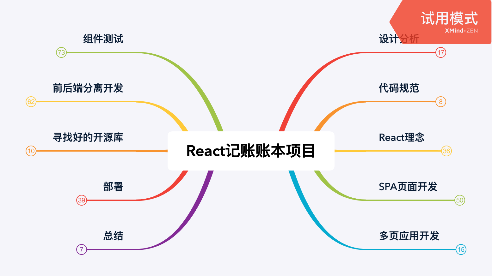
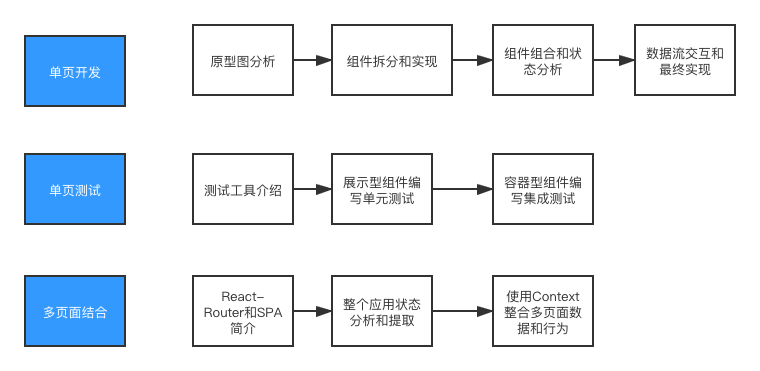

# React 账本项目

> 作者：Bruski
>
> 慕课网课程：[React16组件化+测试+全流程 实战在线账本项目](https://coding.imooc.com/learn/list/302.html)

第一个React实战项目，一个简单的账本应用，涉及的React开发技术面广：React组件编写、Router、Context、HOC等。

- React: 16.13.1
- CSS库：Bootstrap4
- ICON库：react-ionicons 2.1.6
- HTTP库：axios 0.20.0
- 图表库：recharts
- Mock&API Server: json-server 0.16.2
- 静态资源Server: express

## 课程模块

## 项目开发流程

## React应用开发思路

